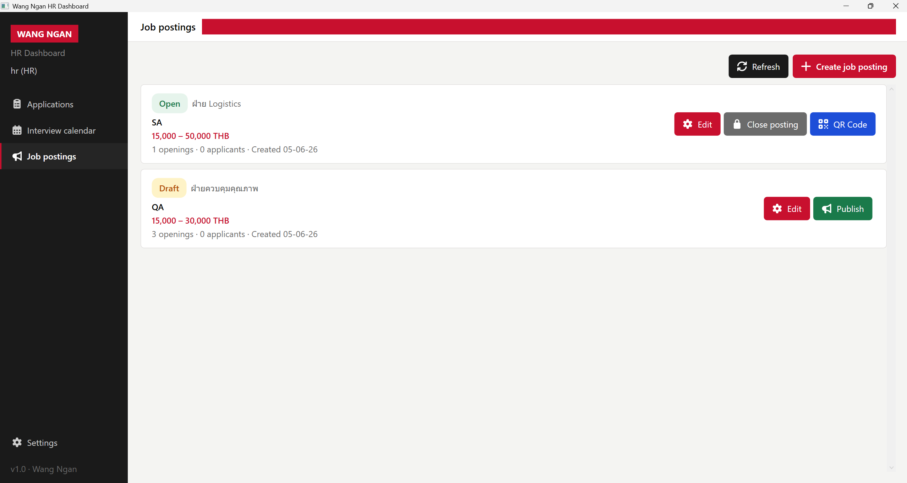
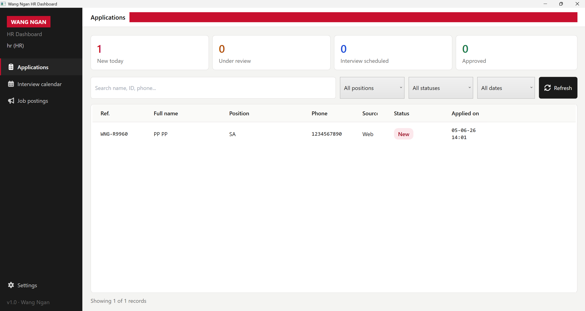
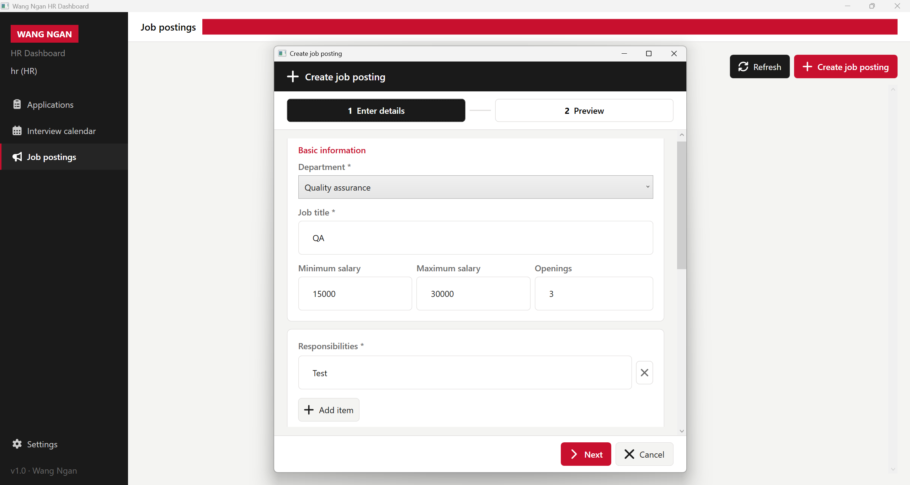
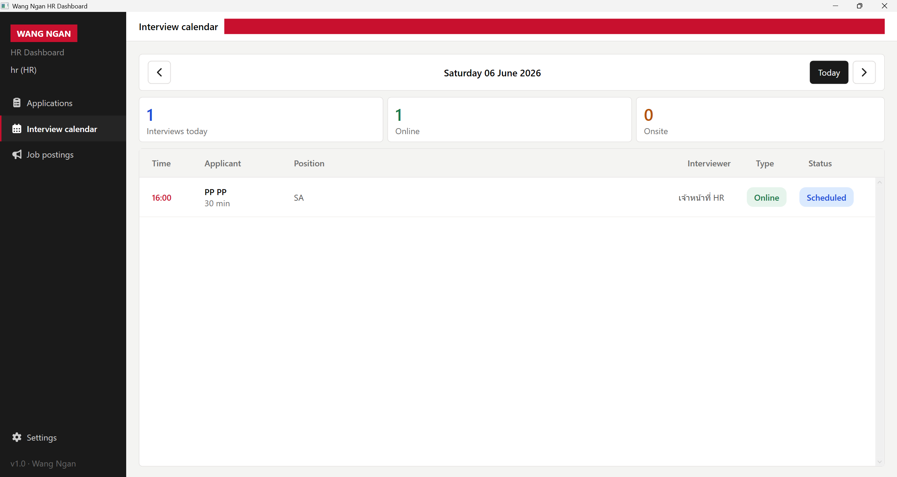
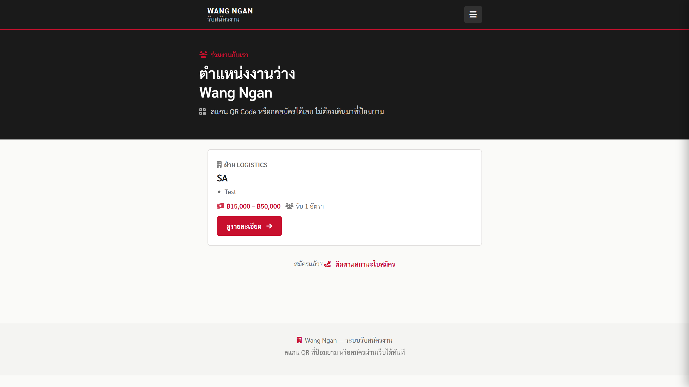
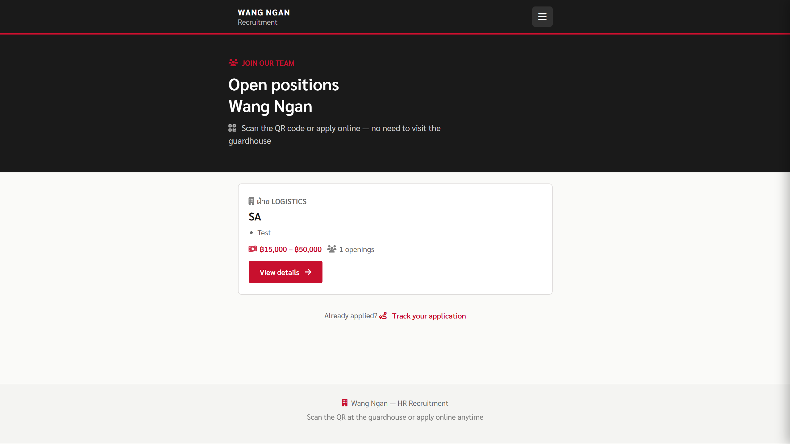
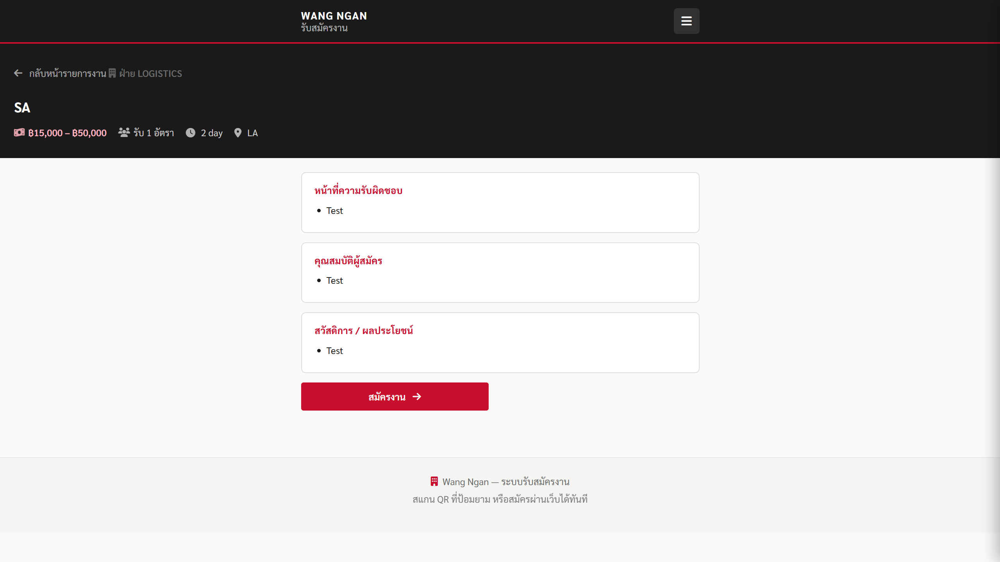
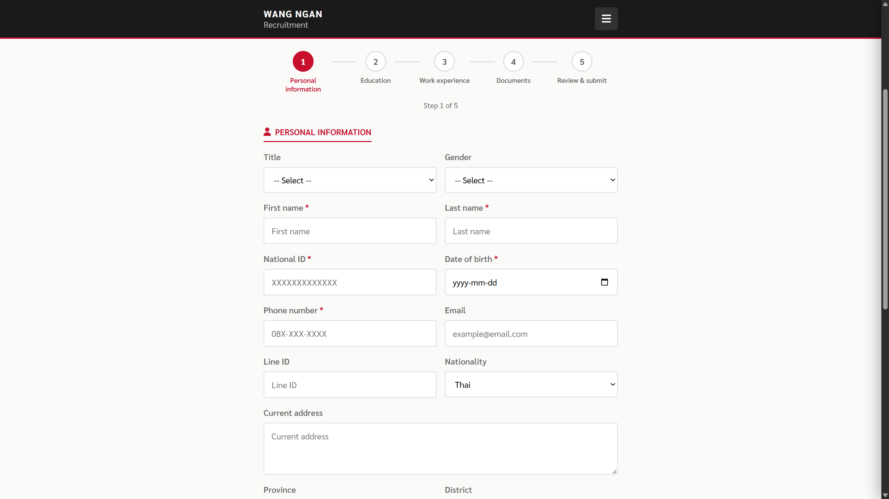
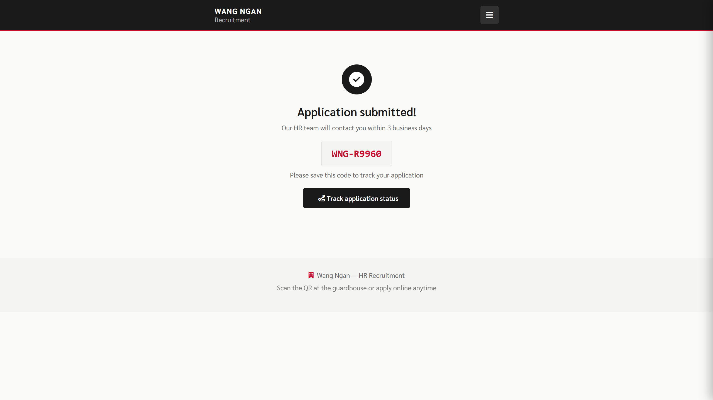
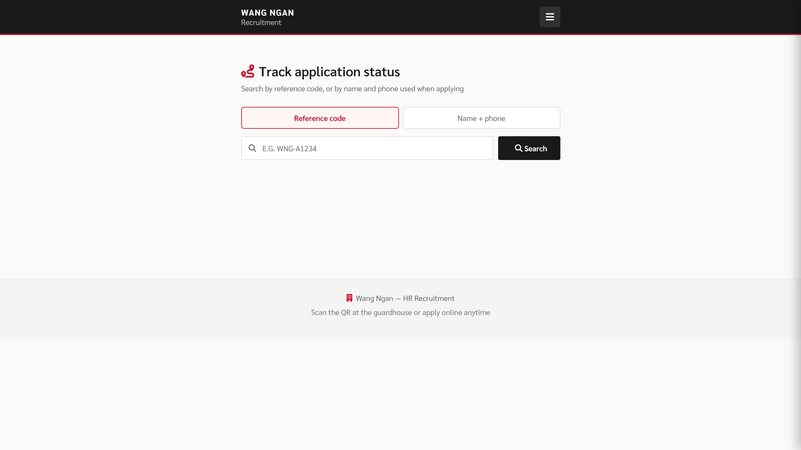

<div align="center">

# Wang Ngan HR

**ระบบรับสมัครงานครบวงจร — Desktop · Web · API**

[](https://dotnet.microsoft.com/)
[](https://www.postgresql.org/)
[](https://redis.io/)
[](https://www.docker.com/)
[](https://learn.microsoft.com/en-us/dotnet/desktop/wpf/)
[](https://dotnet.microsoft.com/apps/aspnet/web-apps/blazor)

<br/>



*HR Dashboard — จัดการประกาศรับสมัคร ใบสมัคร และนัดสัมภาษณ์ในที่เดียว*

</div>

---

## ✨ ฟีเจอร์หลัก

| โมดูล | รายละเอียด |
|--------|------------|
| **ประกาศรับสมัคร** | สร้าง · แก้ไข · เผยแพร่ · ปิดรับ · สร้าง QR Code |
| **ใบสมัคร** | ติดตามสถานะ · ค้นหา · กรองตามตำแหน่ง/วันที่ |
| **ปฏิทินสัมภาษณ์** | นัด Online / Onsite · ดูตารางรายวัน |
| **พอร์ทัลผู้สมัคร** | ดูตำแหน่งว่าง · สมัครออนไลน์ · ติดตามสถานะด้วยรหัสอ้างอิง |
| **หลายภาษา** | ไทย · อังกฤษ · 日本語 |

---

## 🖥️ Screenshots

### HR Dashboard (Desktop)

<table>
<tr>
<td width="50%">

**ใบสมัคร — Applications**



สรุปสถิติรายวัน · ค้นหา · กรองสถานะ

</td>
<td width="50%">

**ประกาศรับสมัคร — Job Postings**


Draft / Open · เงินเดือน · QR Code

</td>
</tr>
<tr>
<td width="50%">

**สร้างประกาศ — Create Job**



ฟอร์ม 2 ขั้นตอน · หน้าที่ · คุณสมบัติ

</td>
<td width="50%">

**ปฏิทินสัมภาษณ์ — Interview Calendar**



นัด Online / Onsite · สถานะ Scheduled

</td>
</tr>
</table>

### พอร์ทัลผู้สมัคร (Web)

<table>
<tr>
<td width="50%">

**ตำแหน่งงานว่าง (TH)**



สแกน QR ที่ป้อมยาม หรือสมัครผ่านเว็บ

</td>
<td width="50%">

**Open Positions (EN)**



รองรับหลายภาษา

</td>
</tr>
<tr>
<td width="50%">

**รายละเอียดตำแหน่ง**



หน้าที่ · คุณสมบัติ · สวัสดิการ

</td>
<td width="50%">

**ฟอร์มสมัครงาน**



5 ขั้นตอน — ข้อมูลส่วนตัว → ส่งใบสมัคร

</td>
</tr>
<tr>
<td width="50%">

**ส่งใบสมัครสำเร็จ**



รับรหัสอ้างอิง WNG-XXXXX

</td>
<td width="50%">

**ติดตามสถานะ**



ค้นหาด้วยรหัส หรือชื่อ + เบอร์โทร

</td>
</tr>
</table>

---


| โปรเจกต์ | เทคโนโลยี | พอร์ต |
|----------|-----------|-------|
| `WangNganHR.API` | ASP.NET Core · EF Core · JWT · Swagger | `5083` |
| `WangNganHR.Desktop` | WPF · MVVM · FontAwesome | — |
| `WangNganHR.Web` | Blazor WebAssembly | `5203` |
| `WangNganHR.Shared` | DTOs · Models ร่วม | — |

**ฐานข้อมูล:** PostgreSQL 16 · **Cache / Jobs:** Redis 7 · **Background jobs:** Hangfire

---

## 🚀 Quick Start

### ความต้องการของระบบ

- [.NET 10 SDK](https://dotnet.microsoft.com/download)
- [Docker Desktop](https://www.docker.com/products/docker-desktop/)
- Windows (สำหรับ Desktop app)

### รันด้วยคำสั่งเดียว

```powershell
cd C:\Projects\WangNganHR
.\start.ps1          # API + Desktop
.\start.ps1 -Web     # + Web portal
```

สคริปต์จะทำให้อัตโนมัติ:
1. เปิด PostgreSQL + Redis (Docker)
2. ตั้งค่า dev certificate (Desktop signing)
3. รัน API ที่ `http://localhost:5083`
4. Build & เปิด Desktop app

### คำสั่งอื่น ๆ

| คำสั่ง | หน้าที่ |
|--------|--------|
| `.\scripts\run-api.ps1` | รัน API อย่างเดียว |
| `.\scripts\stop-api.ps1` | หยุด API |
| `.\scripts\run-desktop.ps1` | Build + เปิด Desktop |
| `.\scripts\run-web.ps1` | รัน Web portal |
| `.\scripts\connect-db.ps1` | เข้า PostgreSQL ผ่าน psql |

### URL สำคัญ

| บริการ | URL |
|--------|-----|
| API / Swagger | http://localhost:5083/swagger |
| Web Portal | http://localhost:5203 |
| PostgreSQL | `localhost:5432` (db: `janomehr`) |

---

## 🔐 บัญชีทดสอบ

| Username | Password | Role |
|----------|----------|------|
| `admin` | `admin123` | Admin |
| `hr` | `hr123` | HR |
| `manager` | `manager123` | Manager |

> Manager ดูประกาศรับสมัครได้ — สร้าง/แก้ไข/เผยแพร่ ต้องใช้ HR หรือ Admin

---

## 📁 โครงสร้างโปรเจกต์

```
WangNganHR/
├── WangNganHR.API/          # REST API + EF Core migrations
├── WangNganHR.Desktop/      # WPF HR Dashboard
├── WangNganHR.Web/          # Blazor หน้ารับสมัครสาธารณะ
├── WangNganHR.Shared/       # Shared models & DTOs
├── scripts/                 # PowerShell dev scripts
├── docs/screenshots/        # README screenshots
├── docker-compose.yml       # PostgreSQL + Redis
└── start.ps1                # จุดเริ่มต้นหลัก
```

---

## ⚠️ หมายเหตุ

- **อย่าปิดหน้าต่าง API** ขณะใช้ Desktop / Web
- หลังแก้ UI Desktop ให้รัน `.\scripts\run-desktop.ps1` เพื่อ rebuild
- อย่ารัน `dotnet run` ซ้ำสำหรับ API — ใช้ `run-api.ps1` แทน

---

<div align="center">

**Wang Ngan** · v1.0 · ระบบรับสมัครงาน

</div>
